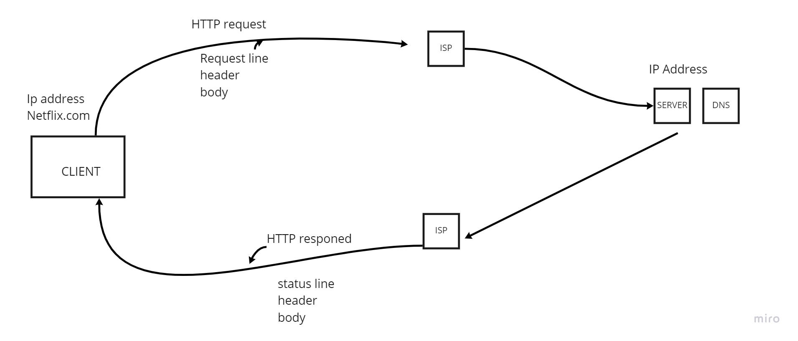

# Movies-Library
 My name is Zaid Jarrar

## WRRC

## Overview
This a movie website to check out the best movies ever made, old, new, it doesn't matter as long as it's gold.

## Features:
they are still a work in progress but we have a favorite list feature, genre, search,trending,region already added and more to come................................
## Getting Started
To make something like this one must

1) npm init -y 

2) npm install express cors (express being the backend library and cors the connector between back and front ends)

3) make sure that the package.json main is the same name as server.js 

4) callback the express and cors, and the data.json for the project data from the node modules

5) add .get methods to identify what should the server do when the client asks for a specific request

6) make a constructor to build objects of the movies data in an array if needed

7) connect the constructor with the handlerfunctions and return the response required for each request

8) add a listner to a specific port number for your server.

9) run npm start and see the results

get API key and urls for the features needed to connect
make constructors for the urls data and make set the url to a promise and construct them.

